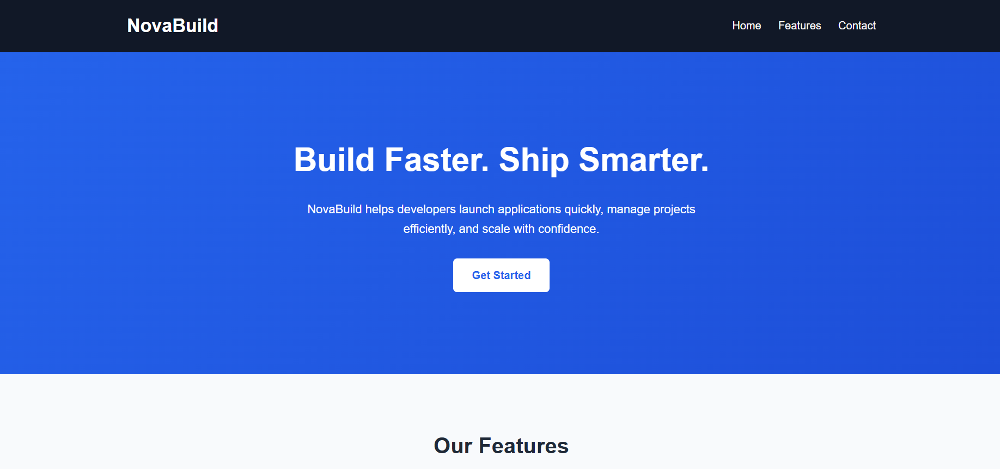
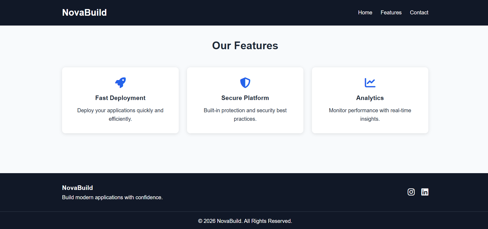

# NovaBuild - Responsive Landing Page

## Overview
NovaBuild is a simple and responsive landing page created using HTML and CSS. The project demonstrates the use of modern web development concepts such as semantic HTML, Flexbox, CSS Grid, and Media Queries.

## Screenshot




## Features
- Responsive navigation bar
- Hero section with call-to-action button
- Features section using CSS Grid
- Footer with social media links
- Mobile-friendly design
- Clean and modern user interface

## Technologies Used
- HTML5
- CSS3
- Flexbox
- CSS Grid
- Media Queries
- Font Awesome Icons

## Project Structure

```
NovaBuild/
│
├── index.html
├── style.css
└── README.md
```

## Concepts Demonstrated

### HTML5
- Semantic tags such as:
  - Header
  - Nav
  - Section
  - Footer

### CSS3
- Styling and layout design
- Hover effects
- Responsive design

### Flexbox
Used for:
- Navigation bar layout
- Footer layout

### CSS Grid
Used for:
- Features section cards

### Media Queries
Used to:
- Make the website responsive on tablets and mobile devices
- Adjust layouts for smaller screens

## How to Run

1. Download or clone the repository.
2. Open the project folder in VS Code.
3. Install the Live Server extension (optional).
4. Open `index.html` in a browser or run with Live Server.

## Learning Outcome

Through this project, I learned:

- HTML page structure
- CSS styling techniques
- Flexbox layout
- Grid layout
- Responsive web design
- Media queries for different screen sizes

## Author

Created as part of the Elevate Labs Web Development Internship Task 1.