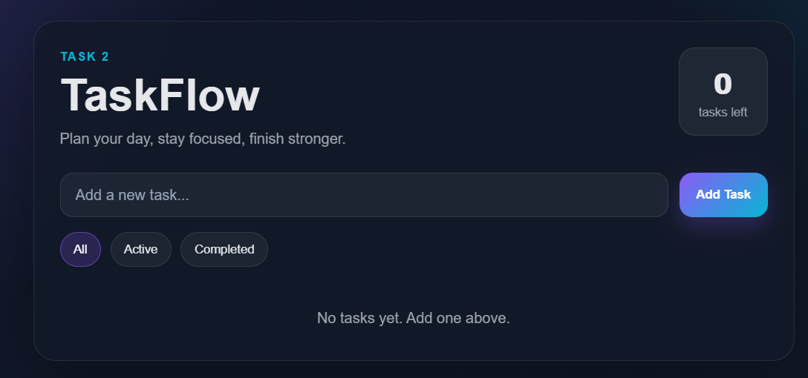
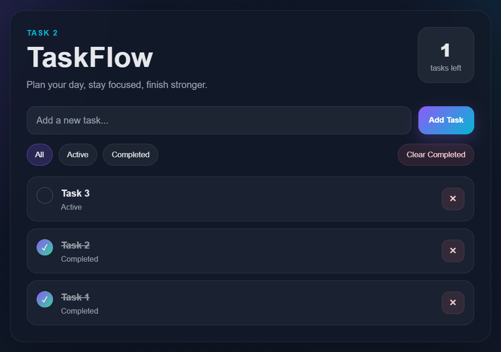

# TaskFlow - To-Do List Web App

## Overview

TaskFlow is a responsive To-Do List web application built using HTML, CSS, and Vanilla JavaScript.

The application allows users to:

- Add new tasks
- Mark tasks as completed
- Delete tasks
- Filter tasks (All, Active, Completed)
- Clear completed tasks
- Store tasks using Local Storage

The interface updates instantly without requiring a page reload.

---

## Screenshot




## Features

### Task Management
- Add tasks dynamically
- Delete tasks
- Mark tasks as complete/incomplete

### Filters
- View all tasks
- View active tasks
- View completed tasks

### Local Storage
- Tasks remain saved even after refreshing the browser

### Responsive Design
- Works on desktop, tablet, and mobile devices

---

## Technologies Used

- HTML5
- CSS3
- JavaScript (ES6)
- DOM Manipulation
- Event Listeners
- Local Storage

---

## Project Structure

```text
Task2/
│
├── index.html
├── style.css
├── script.js
└── README.md
```

---

## Concepts Demonstrated

### HTML
- Semantic structure
- Forms
- Lists
- Buttons

### CSS
- Responsive design
- Flexbox
- CSS Grid
- Media Queries
- Hover effects

### JavaScript
- DOM Manipulation
- Event Handling
- Dynamic UI Updates
- Local Storage
- Arrays and Objects
- ES6 Features

---

## How to Run

1. Download or clone the repository.
2. Open the project folder in VS Code.
3. Open `index.html` in a browser.
4. Or use the Live Server extension for automatic reloading.

---

## Learning Outcomes

Through this project, I learned:

- How to manipulate the DOM using JavaScript
- How event listeners work
- How to dynamically create and remove elements
- How to update the UI without page reloads
- How to store data using Local Storage
- How to build responsive web applications

---

## Interview Questions Covered

1. How do you select elements in the DOM?
2. What are event listeners?
3. Explain event delegation.
4. How do you prevent default behavior in JavaScript?
5. Difference between var, let, and const.
6. Event bubbling and capturing.
7. How do you add and remove classes?
8. What is closure in JavaScript?
9. Explain arrow functions.
10. Difference between == and ===.

---

## Author

Created as part of the Elevate Labs Web Development Internship – Task 2.
