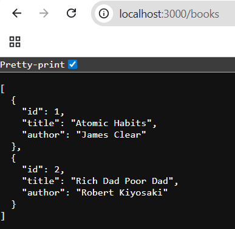
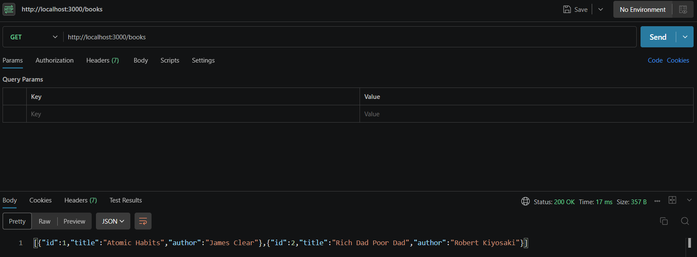
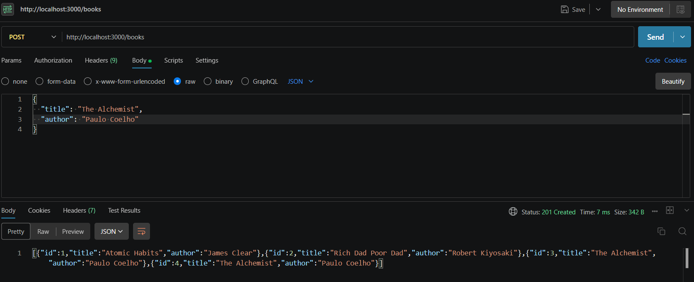
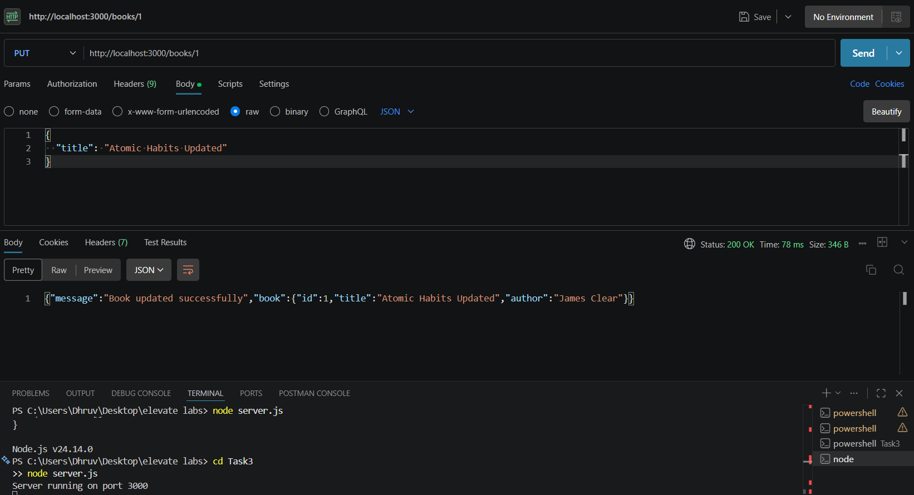
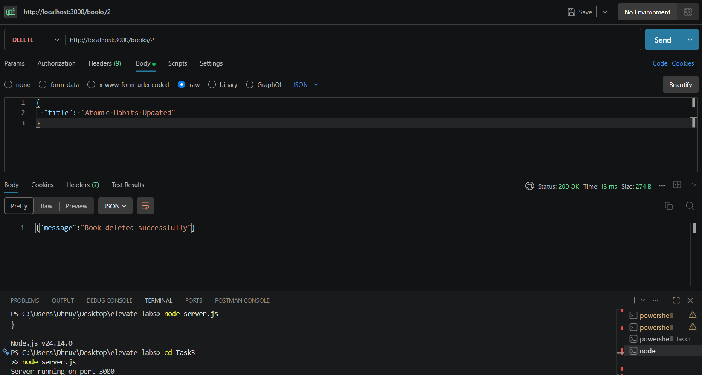

# Book Management REST API

## Overview

This project is a simple REST API built using Node.js and Express.js. It performs CRUD (Create, Read, Update, Delete) operations on a collection of books stored in memory.

The API was developed as part of the Elevate Labs Internship Task 3.

---

## Features

- Get all books
- Add a new book
- Update existing books
- Delete books
- JSON request and response handling
- RESTful API endpoints

---

## Technologies Used

- Node.js
- Express.js
- JavaScript
- Postman

---

## API Endpoints

### GET /books

Returns all books.

### POST /books

Adds a new book.

Example Request:

```json
{
  "title": "The Alchemist",
  "author": "Paulo Coelho"
}
```

### PUT /books/:id

Updates an existing book.

Example Request:

```json
{
  "title": "Atomic Habits Updated"
}
```

### DELETE /books/:id

Deletes a book by ID.

---

## Screenshots

### 1. OUTPUT



### 2. GET Books



### 3. POST Book



### 4. PUT Book



### 5. DELETE Book



---

## Project Structure

```text
Task3
│
├── images
│   ├── img1.png
│   ├── img2.png
│   ├── img3.png
│   ├── img4.png
│   └── img5.png
│
├── server.js
├── package.json
├── package-lock.json
└── README.md
```

---

## How to Run

Install dependencies:

```bash
npm install
```

Start the server:

```bash
node server.js
```

Server runs on:

```text
http://localhost:3000
```

---

## Learning Outcomes

- Understanding REST APIs
- Express.js Routing
- CRUD Operations
- HTTP Methods (GET, POST, PUT, DELETE)
- JSON Data Handling
- API Testing using Postman

