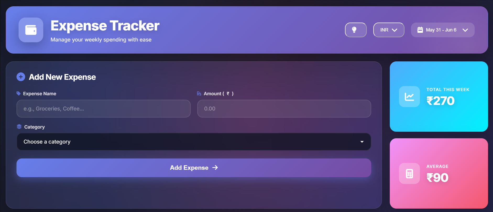
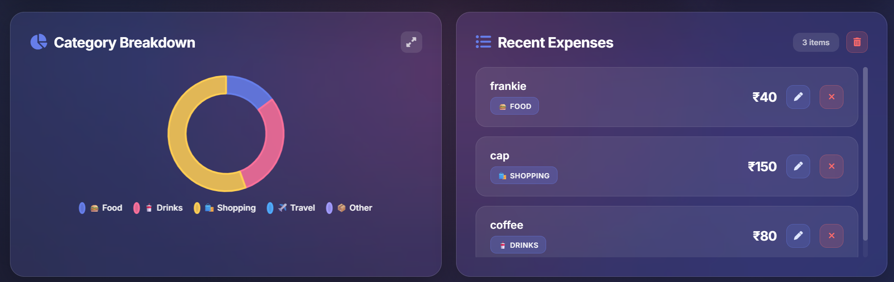
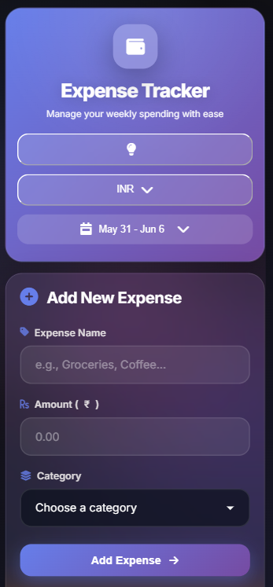
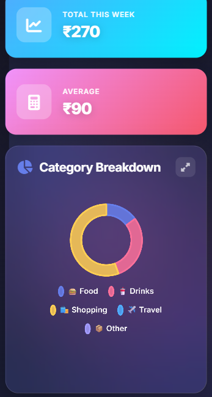
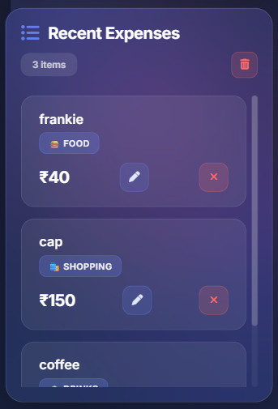

# Responsive Expense Tracker

## Overview
A modern and responsive Expense Tracker web application that helps users manage weekly expenses, monitor spending habits, and visualize expense distribution through interactive charts.

This project was enhanced with CSS Media Queries to provide a seamless experience across desktop, tablet, and mobile devices.

---

## Features

- Add and manage expenses
- Categorize expenses
- Weekly expense tracking
- Average spending calculation
- Category-wise expense breakdown
- Recent expense history
- Interactive dashboard UI
- Responsive design for all screen sizes
- Modern glassmorphism-inspired interface

---

## Technologies Used

- HTML5
- CSS3
- JavaScript
- Chart.js
- CSS Media Queries

---

## Responsive Enhancements

The application was optimized for different screen sizes using CSS Media Queries.

### Desktop View
- Two-column dashboard layout
- Side-by-side analytics and expense sections
- Full-width header with controls

### Tablet View
- Adaptive dashboard layout
- Improved spacing and alignment
- Flexible card arrangement

### Mobile View
- Single-column layout
- Responsive forms and buttons
- Mobile-friendly charts
- Optimized expense list
- Responsive popups and modals
- Improved readability and usability

---

## Screenshots

### Desktop View

#### Desktop Screenshot 1


#### Desktop Screenshot 2


---

### Mobile View

#### Mobile Screenshot 1


#### Mobile Screenshot 2


#### Mobile Screenshot 3


---

## Project Structure

```text
Task4/
│
├── index.html
├── style.css
├── script.js
├── README.md
│
└── screenshots/
    ├── desktop-1.png
    ├── desktop-2.png
    ├── mobile-1.png
    ├── mobile-2.png
    └── mobile-3.png
```

---

## How to Run

1. Download or clone the repository.

```bash
git clone https://github.com/Dhruv220605/Elevate-lab-training/tree/main/Task4
```

2. Open the project folder.

3. Launch `index.html` in your browser.

4. Test responsiveness using:
   - Chrome DevTools
   - Device Toolbar
   - Different screen sizes

---

## Learning Outcomes

- Understanding CSS Media Queries
- Creating responsive layouts
- Mobile-first design principles
- Improving user experience across devices
- Testing responsive web applications

---

## Outcome

Successfully converted the Expense Tracker into a responsive web application that adapts smoothly to desktop, tablet, and mobile screens while maintaining functionality and visual consistency.    
