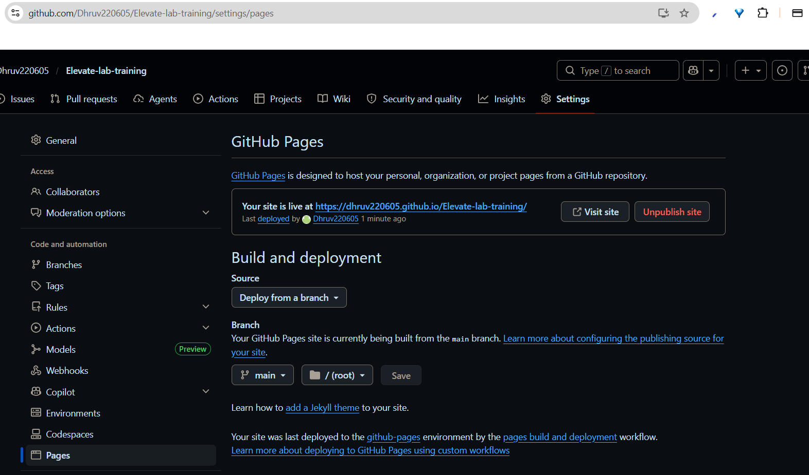

# Task 5 - Deploy a Static Website Using GitHub Pages

## Objective
Host a simple static website using GitHub Pages.

## Screenshots

### GitHub Pages Settings

---

### Live Website

## Technologies Used
- HTML5
- CSS3
- JavaScript
- GitHub Pages

## Features
- Responsive Portfolio Website
- About Section
- Projects Section
- Mobile-Friendly Layout

## Live Website
- https://dhruv220605.github.io/Elevate-lab-training/

## Deployment Steps
1. Created a GitHub repository.
2. Added website files.
3. Enabled GitHub Pages.
4. Selected main branch as deployment source.
5. Successfully hosted the website.

## Outcome
Learned GitHub Pages deployment workflow and static website hosting.