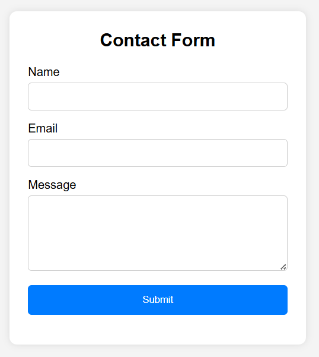
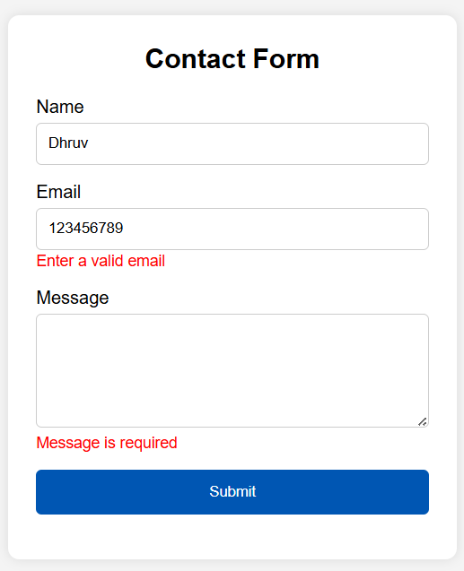
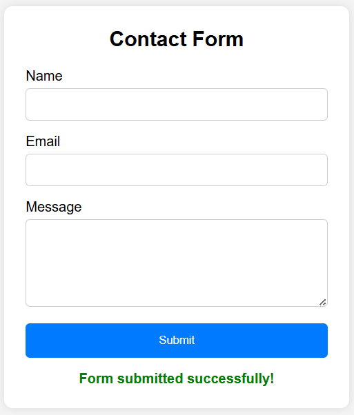

# Contact Form Validation

## Objective
Build a contact form with client-side validation using JavaScript.

## Features
- Name validation
- Email validation using Regex
- Message validation
- Error messages below inputs
- Success message after valid submission
- Prevent form submission when inputs are invalid

## Technologies Used
- HTML
- CSS
- JavaScript

## Screenshots

### Contact Form

### Validation Errors

### Successful Submission

## How to Run
1. Download the project.
2. Open `index.html` in your browser.
3. Test different inputs.

## Learning Outcomes
- Form Elements
- Event Handling
- DOM Manipulation
- Validation
- Regex